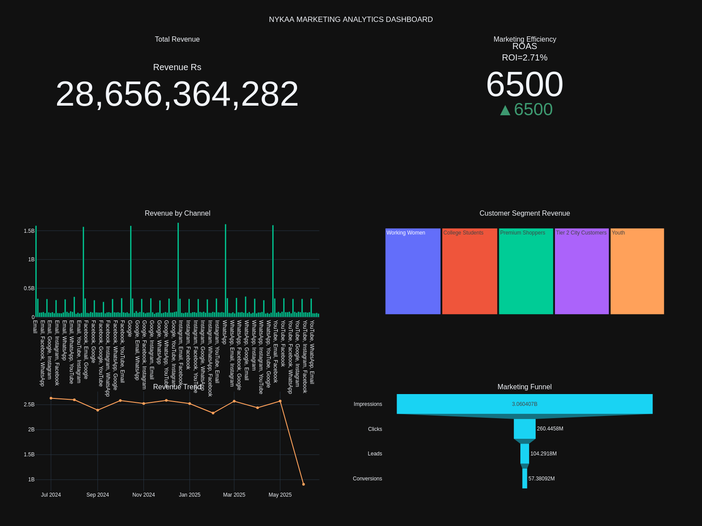
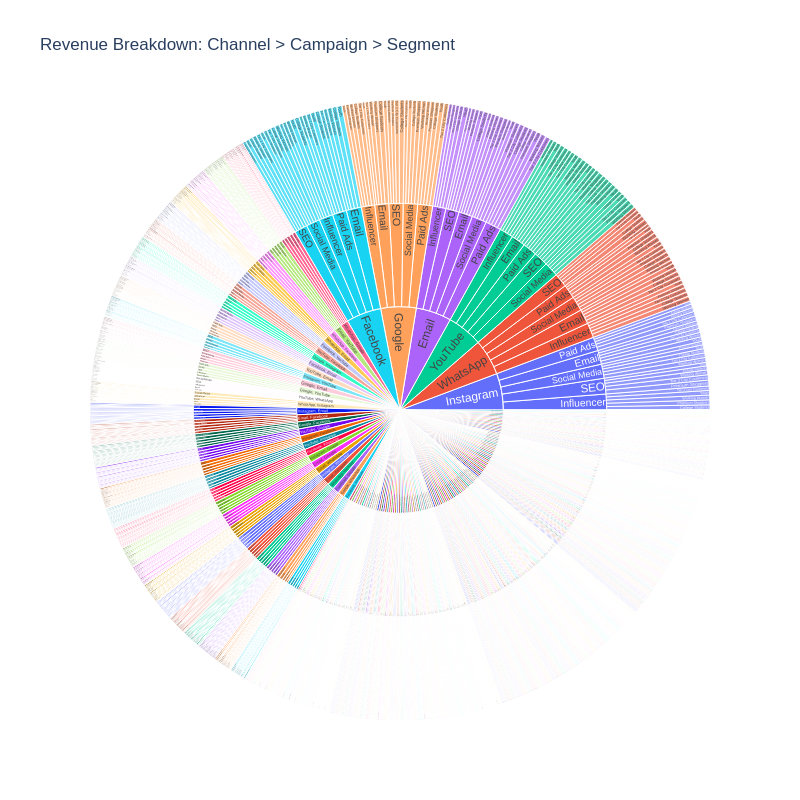

# Marketing Campaign Performance Analysis | Python

**Python · pandas · NumPy · Matplotlib · Seaborn · Plotly**

------------------------------------------------------------------------

## 📌 Project Overview

This project analyses Nykaa's marketing campaign dataset and builds an interactive analytics dashboard in Python. It takes raw campaign-level data (impressions, clicks, leads, conversions, spend, and revenue) and turns it into a set of derived performance metrics, segment breakdowns, and an executive dashboard.

The guiding question: *"Across campaigns, channels, and customer segments, where is marketing spend converting efficiently, and where does the funnel leak?"*

The focus was on three goals — engineering meaningful efficiency metrics from raw counts, breaking performance down by campaign type, channel, segment, and audience, and assembling a single-view Plotly dashboard for marketing oversight.

------------------------------------------------------------------------

## 🛠️ Tools Used

-   **Python** — core analysis
-   **pandas / NumPy** — data loading, cleaning, feature engineering, aggregation
-   **Matplotlib / Seaborn** — static charts (campaign, segment, monthly trend)
-   **Plotly** — interactive multi-panel dashboard, treemap, funnel, and sunburst

------------------------------------------------------------------------

## 📊 The Dataset

-   **55,555 campaign records** across 16 columns, no missing values
-   Fields include: campaign type, channel(s) used, target audience, customer segment, impressions, clicks, leads, conversions, revenue, acquisition cost, ROI, language, engagement score, and date
-   Date range spans roughly mid-2024 through mid-2025

------------------------------------------------------------------------

## 🧮 Metrics Engineered

From the raw counts, the analysis derives the standard marketing efficiency metrics, each guarded against divide-by-zero:

| Metric | Definition |
|--------|------------|
| CTR | Clicks ÷ Impressions × 100 |
| Conversion Rate | Conversions ÷ Clicks × 100 |
| Cost per Click (CPC) | Acquisition Cost ÷ Clicks |
| Cost per Lead (CPL) | Acquisition Cost ÷ Leads |
| Cost per Acquisition (CPA) | Acquisition Cost ÷ Conversions |

------------------------------------------------------------------------

## 📈 Headline Numbers

-   **Total Revenue:** ₹28.66B
-   **Total Spend:** ₹20.96M
-   **Average ROI:** 2.71

**Marketing funnel (aggregate):**

| Stage | Volume | Conversion from prior stage |
|-------|--------|-----------------------------|
| Impressions | 3.06B | — |
| Clicks | 260.4M | 8.5% (CTR) |
| Leads | 104.3M | 40.0% |
| Conversions | 57.4M | 55.0% |

The sharpest drop-off is impressions → clicks, where roughly 91% of impressions never convert to a click — the expected top-of-funnel bottleneck.

------------------------------------------------------------------------

## 🔍 Breakdowns

-   **By campaign type:** Revenue is near-evenly split across Influencer, Social Media, Paid Ads, SEO, and Email (all within ~1.5% of each other). On efficiency, **Social Media posts the highest average ROI (2.75)**, with Email lowest (2.68).
-   **By customer segment:** Working Women generate the most revenue, followed by College Students and Premium Shoppers — again, a tight spread.
-   **By target audience:** Premium Shoppers lead on both revenue and ROI (2.80).
-   **By channel:** Instagram is the strongest single channel by revenue; WhatsApp shows the best ROI among single channels.

------------------------------------------------------------------------

## 🖼️ Dashboard

The Plotly dashboard combines KPIs, a channel bar chart, a customer-segment treemap, a revenue trend line, and a conversion funnel in one view. A sunburst chart drills revenue down through Channel → Campaign Type → Customer Segment.

------------------------------------------------------------------------

## 🧠 Key Analytical Decisions

*The judgement calls that shaped this analysis: not just what was done but why.*

-   **Used ROI as the headline efficiency metric.** ROI is already validated in the source data and is directly comparable across campaigns, which makes it a more stable basis for ranking performance than a raw revenue-to-cost ratio.
-   **Treated impressions to clicks as the primary funnel signal.** Lead and conversion rates further down the funnel are healthy; the largest volume loss happens at the top, so click-through is where optimisation effort would pay off most.
-   **Reported single channels separately from channel combinations.** The channel field mixes individual channels with combinations such as "WhatsApp, YouTube, Google" (156 distinct values in total), so they are grouped separately to avoid double-counting a campaign's revenue.
-   **Guarded every derived metric against divide-by-zero.** Each ratio (CTR, conversion rate, CPC, CPL, CPA) uses `np.where` to return 0 when the denominator is 0, so campaigns with no clicks or conversions produce clean values instead of errors.

------------------------------------------------------------------------

## ⚠️ Assumptions & Limitations

-   **Revenue is attributed at the campaign level (single-touch).** Each record's revenue is credited to that campaign; the analysis does not model multi-touch journeys where several campaigns contribute to one conversion.
-   **Efficiency averages are unweighted.** ROI, CTR and the cost metrics are simple means across campaigns, so a low-spend campaign counts the same as a high-spend one in the averages.
-   **Channel figures are fragmented by combination values.** Because the channel field contains 156 single-and-combination values, channel-level reads are cleaner after splitting the combinations into their individual channels.
-   **The analysis is descriptive, not causal.** It surfaces where performance is strong or weak but does not establish that any campaign, channel or segment *causes* the observed differences.

------------------------------------------------------------------------

## 📬 Contact

**Data Analyst:** Shruti Pingle

**LinkedIn:** [Profile](https://www.linkedin.com/in/shruti-pingle-aa8034196)

**Email:** [shrutipingle02@gmail.com](mailto:shrutipingle02@gmail.com)

------------------------------------------------------------------------

*Data: Nykaa Marketing Campaign Dataset | Tools: Python (pandas, NumPy, Matplotlib, Seaborn, Plotly) | Records: 55,555*
